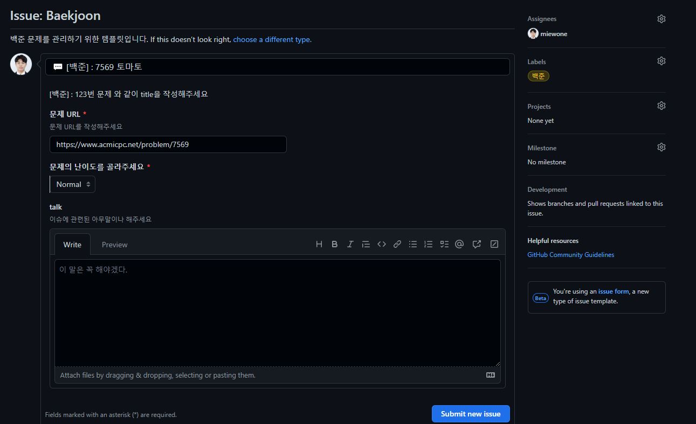
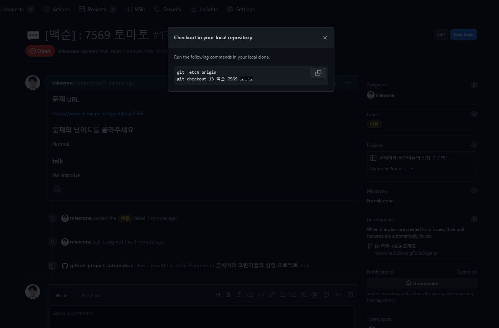
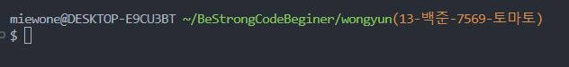

# BeStrongCodeBeginer
코린이의, 코린이에 의한, 코린이를 위한 프로젝트

# 프로젝트 관리 방법

## 1. Issue를 만듭니디.

[Issue Link](https://github.com/miewone/BeStrongCodeBeginer/issues/new/choose) 해당 링크를 눌러 이슈를 만들러 갑니다. 

백준, leetcode에 맞게 들어가고 주어진 형식에 맞춰 작성합니다.

Issue에서 Assigness에 your self를 선택하여 자기 자신에게 해당 이슈를 할당합니다.

Project는 이슈가 생성되면서 자동적으로 적용됩니다.

## 2. 브랜치를 만든다 
이슈가 생성된 후 우측 아이템들을 보면 Development가 보입니다. 

*Create a branch* 를 클릭하여 해당 이슈 브런치를 만듭니다.

그 후 사진과 같이 나온 팝업 글을 복사하여 개발환경에 복사 붙여 넣기합니다.

브랜치로 옮겨간 사진

## 2. 코드를 작성한다.

코드를 작성해 갑니다.

## 3. git